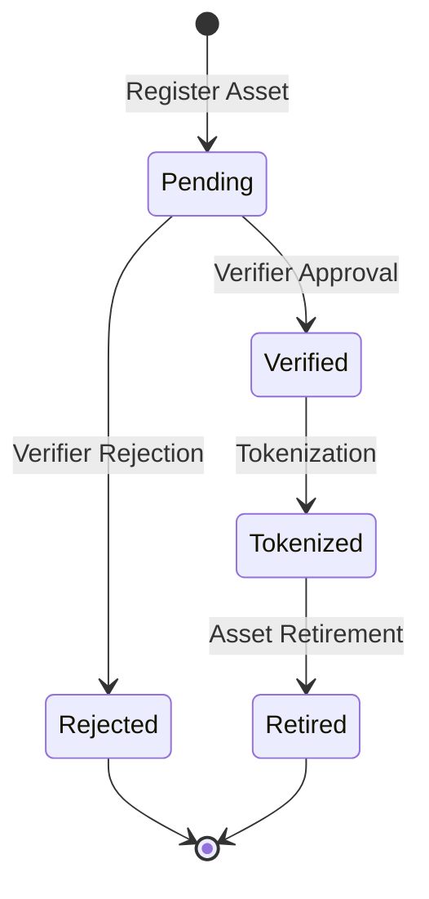

# InitList: Decentralized Asset Registry

InitList is an innovative blockchain platform that enables seamless registration and tokenization of physical assets on the Stacks blockchain. By creating a secure bridge between tangible assets and digital tokens, InitList empowers asset owners to unlock liquidity, enable fractional ownership, and simplify complex asset management processes.

## Overview

ChainMint provides a complete lifecycle management system for tokenized assets, including:

- Asset registration and verification
- Tokenization of verified assets
- Fractional ownership management
- Secure token transfers with compliance checks
- Asset retirement and emergency controls

## Architecture

The platform is built around a central smart contract that manages the entire asset lifecycle through various stages:



### Core Components

1. **Asset Registry**: Tracks all registered assets and their current status
2. **Token Management**: Handles the creation and transfer of asset tokens
3. **Verification System**: Manages authorized verifiers and the asset verification process
4. **Compliance Engine**: Ensures all transfers meet regulatory requirements

## Contract Documentation

### Key Data Structures

- `assets`: Stores core asset information and status
- `asset-tokens`: Contains tokenization details for each asset
- `token-balances`: Tracks token ownership
- `authorized-verifiers`: Maintains list of approved verifiers
- `asset-transfers`: Records transfer history

### Access Control

- Contract Owner: Has administrative privileges
- Asset Owners: Can manage their registered assets
- Authorized Verifiers: Can verify assets
- Token Holders: Can transfer tokens within compliance limits

## Getting Started

### Prerequisites

- Clarinet
- Stacks wallet
- API access to asset metadata storage

### Basic Usage

1. **Register an Asset**
```clarity
(contract-call? .chain-mint register-asset
    "asset123"
    "https://metadata.url/asset123"
    "compliance-hash-123"
)
```

2. **Verify an Asset**
```clarity
(contract-call? .chain-mint verify-asset
    "asset123"
    true
)
```

3. **Tokenize an Asset**
```clarity
(contract-call? .chain-mint tokenize-asset
    "asset123"
    u1000000
    u6
    "https://token.uri/asset123"
)
```

## Function Reference

### Asset Management

#### `register-asset`
```clarity
(register-asset asset-id metadata-url compliance-hash)
```
Registers a new physical asset in the system.

#### `verify-asset`
```clarity
(verify-asset asset-id approve)
```
Verifies or rejects an asset (authorized verifiers only).

#### `tokenize-asset`
```clarity
(tokenize-asset asset-id total-supply decimals token-uri)
```
Creates tokens for a verified asset.

### Token Operations

#### `transfer-tokens`
```clarity
(transfer-tokens asset-id recipient amount)
```
Transfers tokens between users with compliance checks.

### Administrative Functions

#### `add-verifier`
```clarity
(add-verifier verifier)
```
Adds a new authorized verifier.

#### `emergency-transfer`
```clarity
(emergency-transfer asset-id new-owner)
```
Emergency function for contract owner to transfer asset ownership.

## Development

### Testing

Run the test suite using Clarinet:
```bash
clarinet test
```

### Local Development

1. Clone the repository
2. Install dependencies
3. Start Clarinet console:
```bash
clarinet console
```

## Security Considerations

### Asset Verification
- Only authorized verifiers can approve assets
- Verification status cannot be reversed once approved
- Multiple verification steps recommended for high-value assets

### Token Transfers
- Built-in compliance checks for all transfers
- Balance verification before transfers
- Transfer history maintained for audit purposes

### Access Control
- Role-based access control for all sensitive operations
- Emergency controls limited to contract owner
- Asset operations restricted to verified owners

### Known Limitations
- Single contract owner
- Synchronous verification process
- Basic compliance checks (should be enhanced for production)